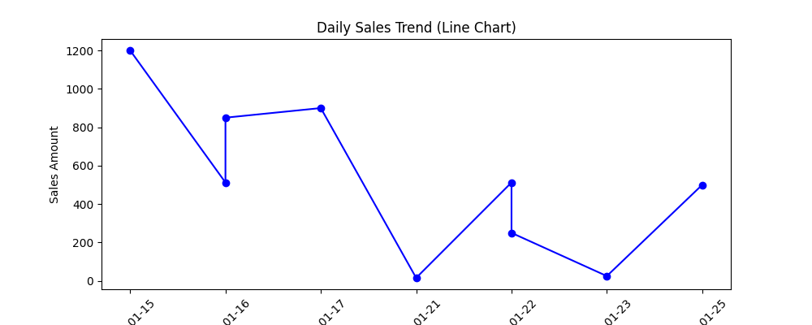
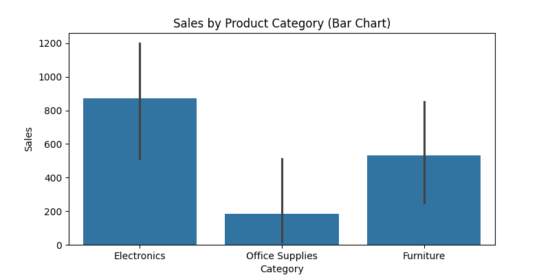
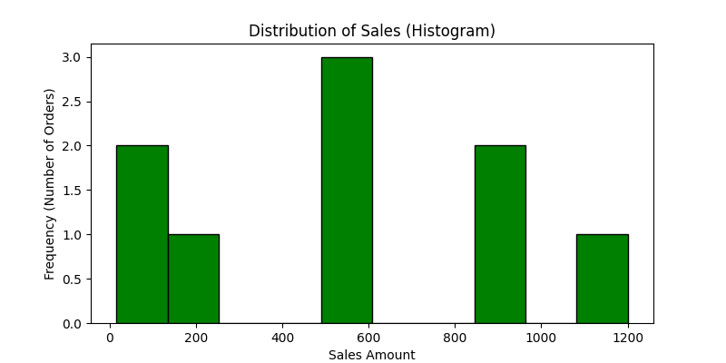

B. Write a Program to implement various types of visualization in python.

ALGORITHM:

**Step 1:** Start.

**Step 2:** Import the pandas library for data manipulation, and the matplotlib.pyplot and seaborn libraries for graphical plotting.

**Step 3:** Read the dataset (sales_data.csv) into a Pandas DataFrame.

**Step 4:** Perform basic data cleaning by dropping duplicate rows, filling missing values in the 'Sales' column with the calculated mean, and removing any remaining empty rows.

**Step 5:** Sort the dataset chronologically based on the 'Date' column to ensure accurate time-series plotting.

**Step 6:** Generate a Line Chart using Matplotlib plotting 'Date' on the X-axis and 'Sales' on the Y-axis to visualize the trend of sales over time. Display the chart.

**Step 7:** Generate a Bar Chart using Seaborn with 'Product_Category' on the X-axis and 'Sales' on the Y-axis to compare the performance of different categories. Display the chart.

**Step 8:** Generate a Histogram using Matplotlib to plot the frequency distribution of the 'Sales' column, showing how often different sales amounts occur. Display the chart.

**Step 9:** Stop.

OUTPUT:

